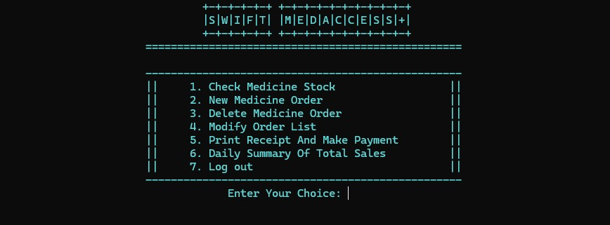

<h1 align="center"> Swift MedAccess+ - Pharmacy Management System </h1>

   
   
   

  

## 📋 Overview

**Swift MedAccess+** is a console-based Pharmacy Management System developed in C++ for Windows. The system provides functionality for managing medicine inventory, processing customer orders, generating receipts, and tracking daily sales. It features an admin portal with authentication and implements a linked list data structure for efficient order management. It is the first academic programming project done in my academic life while undertaking the Introduction to Programming course.

## 🎯 Project Purpose

This academic project was developed to demonstrate:
- Object-Oriented Programming (OOP) principles in C++
- Data structure implementation (Linked Lists)
- File handling operations
- User authentication system
- Menu-driven console application development

## ✨ Key Features

###  Authentication System
- **Login System**: Username/email and password authentication
- **Admin Registration**: Add new administrators to the system
- **Password Recovery**: Username and password retrieval functionality
- **Credential Storage**: File-based user database

###  Medicine Management
- **Medicine Stock**: View complete medicine inventory with prices
- **Pre-loaded Inventory**: 10 OTC (Over-The-Counter) medicines
- **Medicine Details**: ID, type, name, and price information
- **Stock Display**: Read medicine list from external file

###  Order Management
- **New Orders**: Create medicine orders with customer details
- **Order Modification**: Edit existing order information
- **Order Deletion**: Remove orders from the system
- **Order Tracking**: Unique receipt numbers for each transaction
- **Multi-item Orders**: Support up to 10 medicines per transaction

###  Receipt & Payment
- **Receipt Generation**: Print detailed receipts with itemized billing
- **Payment Processing**: Interactive payment validation
- **Customer Information**: Track customer name and order date
- **Total Calculation**: Automatic bill computation

###  Reporting
- **Daily Summary**: Generate comprehensive sales reports
- **File Export**: Save daily summaries to text files
- **Transaction History**: View all orders in the system

## 🛠️ Technologies Used

- **Language**: C++ 
- **Libraries**: 
  - `<iostream>` - Input/output operations
  - `<fstream>` - File handling
  - `<conio.h>` - Console I/O (Windows)
  - `<windows.h>` - Windows API (console colors)
- **Platform**: Windows OS
- **IDE**: Code::Blocks

### Prerequisites

- **Windows OS** (7, 8, 10, or 11)
- **C++ Compiler** (MinGW, TDM-GCC, or MSVC)
- **IDE**: Code::Blocks, Dev-C++, or Visual Studio

## 👥 Project Team

**Developers:**
- Chinmoy
- Ansar
- Shuvro
- Abdullah

*Academic Project - Developed as part of coursework*

## 📄 License

This project is an academic assignment and is provided as-is for educational purposes.

- GitHub: [@LT-Ripjaws](https://github.com/LT-Ripjaws)  
- Email: chinmoyguha676z@gmail.com

  

  

